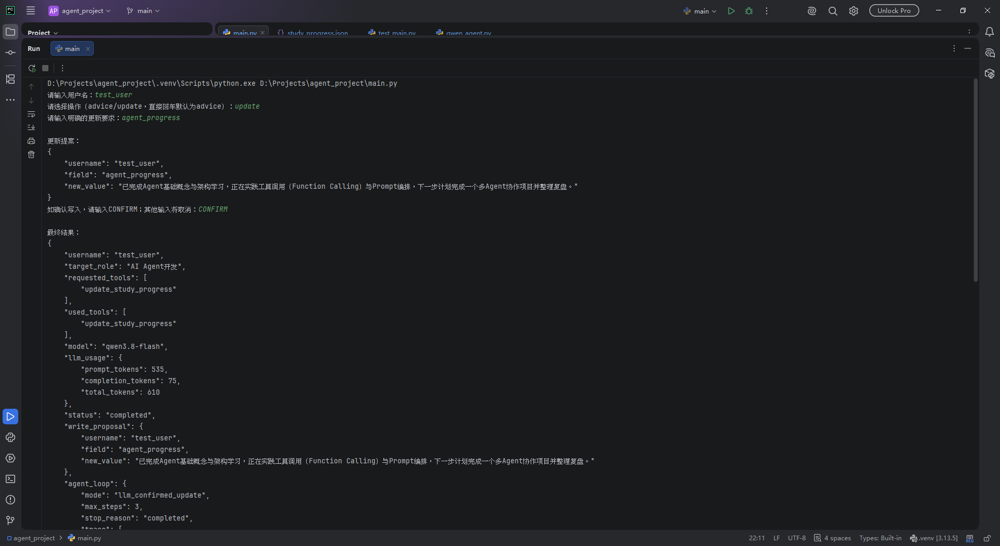

# CareerAgent

CareerAgent 是一个面向求职学习场景的 Python Agent 项目。它会读取脱敏的学习进度，让千问模型选择只读工具，并输出带可校验数据来源的 Python、LeetCode 和 Agent 三类结构化建议。

## 文档导航

- 当前功能、验证结果和下一步：[`PROJECT_STATUS.md`](PROJECT_STATUS.md)
- 第一版包含与不包含的范围：[`PROJECT_SCOPE.md`](PROJECT_SCOPE.md)
- 版本演进与历史验证证据：[`CAREER_AGENT_HISTORY.md`](CAREER_AGENT_HISTORY.md)

## 当前功能

- 加载并验证用户基础资料。
- 使用 `get_study_progress` 读取指定用户的学习进度。
- 已实现受白名单约束的本地更新工具 `update_study_progress`。
- 在用户明确选择更新后，千问生成写入参数提案；只有用户检查后输入 `CONFIRM` 才执行。
- 使用千问 `qwen3.8-flash` 进行 Function Calling（函数调用）。
- 使用 JSON Schema 约束模型输出结构。
- 限制 Agent 最大循环步数，并记录工具、轨迹和停止原因。
- 保留不产生 API 费用的本地规则模式。
- 复习任务使用“整数题号、题名、专题列表、复习状态”的结构化字典。
- 本地可信目录校验题号、题名与专题映射，错误映射不会进入模型上下文。
- 模型建议必须携带 `sources`，Python 会与工具返回的数据逐项核对。

普通建议循环只向模型开放 `get_study_progress`。写入提案必须由用户明确选择 `update` 才会生成，确认前不会修改文件。

学习进度中的复习任务示例：

```json
{
  "problem_id": 560,
  "title": "和为K的子数组",
  "topics": ["前缀和", "哈希表"],
  "status": "待复习"
}
```

LeetCode 建议的数据来源示例：

```json
{
  "sources": {
    "leetcode_topic": "滑动窗口",
    "review_tasks": [
      {
        "problem_id": 560,
        "title": "和为K的子数组",
        "topics": ["前缀和", "哈希表"],
        "status": "待复习"
      }
    ]
  }
}
```

## 环境

- Python 3.13
- Windows / PowerShell
- 千问 AI 平台 OpenAI 兼容接口

## 安装

```powershell
python -m venv .venv
.venv\Scripts\python.exe -m pip install -r requirements.txt
```

复制 `.env.example` 为 `.env`，然后只在本地填写：

```ini
DASHSCOPE_API_KEY=你的千问API密钥
CAREER_AGENT_MODE=llm
```

`.env` 已被 `.gitignore` 忽略。请勿把真实密钥写入代码、截图或提交记录。

## 运行

```powershell
.venv\Scripts\python.exe main.py
```

按提示输入演示用户名：

```text
test_user
```

随后选择操作：

```text
advice  # 生成建议；直接回车也是此模式
update  # 根据明确要求生成更新提案
```

选择 `update` 后，程序会先显示完整提案。核对用户名、字段和新值后：

```text
CONFIRM  # 精确输入此确认词才会保存
其他输入  # 取消，不调用写入工具
```

如需使用完全本地、无 API 费用的规则模式，将 `.env` 中的模式改为：

```ini
CAREER_AGENT_MODE=rule
```

## 测试

```powershell
.venv\Scripts\python.exe -m unittest -v
```

单元测试使用模型响应替身，不会真实调用千问，也不会产生模型费用。

脱敏运行证据：

- [`examples/careeragent_v0_6_review_topics_output.json`](examples/careeragent_v0_6_review_topics_output.json)：只读工具与结构化建议。
- [`examples/careeragent_v0_7_confirmed_update_output.json`](examples/careeragent_v0_7_confirmed_update_output.json)：模型提案、用户确认与写入成功；其中复习任务保留当时的 V0.7 历史结构。

受控写入运行截图：



## 数据流

```text
启动 main.py
→ 加载并验证用户
→ 选择 advice 或 update
├─ advice：千问调用只读工具 → 生成建议和sources → Python核对来源
└─ update：千问生成参数提案 → Python验证 → 用户确认 → 执行或取消
```

## 项目边界

- 建议流程中，千问可以选择只读工具；写入流程仍由程序和用户共同控制。
- `requested_tools` 表示模型提出调用，`used_tools` 表示 Python 已实际执行；取消时后者为空，确认执行后才包含写入工具。
- 当前没有 RAG、多 Agent、网页前端、自动岗位搜索或自动投递。
- `used_tools` 记录实际执行过的工具；`trace` 同时记录模型决策和程序动作。
