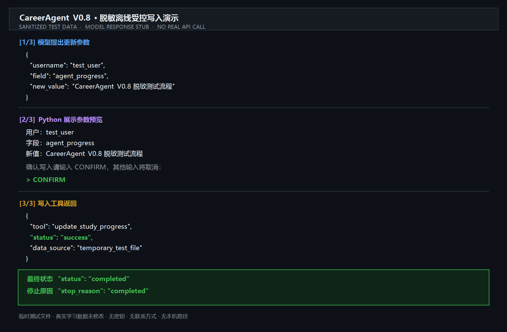

# CareerAgent

CareerAgent 是一个面向求职学习场景的 Python Agent 项目。它使用受控工具读取脱敏岗位、候选人证据和学习进度，由 Python 计算并核对匹配结果，再让千问生成明确标为未验证内容的结构化建议。

最新版本：`V1.3.1`

## 文档导航

- 当前功能与验证结果：[`PROJECT_STATUS.md`](PROJECT_STATUS.md)
- 当前公开版本范围：[`PROJECT_SCOPE.md`](PROJECT_SCOPE.md)
- 版本演进与历史验证证据：[`CAREER_AGENT_HISTORY.md`](CAREER_AGENT_HISTORY.md)

## 当前功能

- 加载并验证用户基础资料。
- 拒绝空白目标岗位、空白已有学习进度和空白文本写入，避免无效数据进入建议或覆盖本地状态。
- 使用 `get_study_progress` 读取指定用户的学习进度。
- 已实现受白名单约束的本地更新工具 `update_study_progress`。
- 在用户明确选择更新后，千问生成写入参数提案；只有用户检查后输入 `CONFIRM` 才执行。
- 使用千问 `qwen3.8-flash` 进行 Function Calling（函数调用）。
- 使用 JSON Schema 约束模型输出结构。
- 限制 Agent 最大循环步数，并记录工具、轨迹和停止原因。
- 保留不产生 API 费用的本地规则模式。
- 复习任务使用“整数题号、题名、专题列表、复习状态”的结构化字典。
- 本地可信目录校验题号、题名与专题映射，错误映射不会进入模型上下文。
- 模型建议必须携带 `sources`，Python 会与工具返回的数据逐项核对。
- V0.9a 新增脱敏岗位与候选人证据数据契约，校验精确字段、非空值、枚举、优先级、布尔验证状态和重复 ID。
- V0.9b 新增岗位要求和候选人证据只读工具，并由 Python 按已验证证据层级计算 `matched`、`partial`、`unverified`、`missing`。
- V1.0 将岗位、候选人证据和学习进度三个只读工具接入 JD 分析 Agent，并由 Python 核对模型返回的状态、证据 ID 和来源。
- 岗位描述与证据描述始终作为待分析数据处理，其中的文字不能扩大工具权限或变成系统指令。
- V1.1 新增 19 个可运行的脱敏离线评估案例、10 组固定夹具和批量评估运行器。
- V1.1.1 将离线评估扩至 26 个案例：按配置的禁止声明检查模型生成的自由文本，单案例异常记为失败后继续运行，并增加恶意 JD 与危险服从行为的配对案例。
- V1.2 新增 `trusted_facts`：只保存 Python 确定的岗位要求 ID、技能 ID、匹配状态及已验证／未验证证据 ID，不接收模型生成的解释、任务或问题；生成时会重新核对证据技能、能力层级和四种状态。
- V1.3 新增本地 FastAPI 只读服务，提供健康检查、岗位要求查询和默认离线分析接口；客户端不能指定数据文件、模型或输出位置。
- 离线分析接口直接复用 Python 确定性匹配和 V1.2 `trusted_facts`，并明确返回 `analysis_mode=offline_deterministic` 与 `model_generated=false`。
- 模型分析通过 `analysis_metadata` 标记为 `model_generated` 和 `unverified`；模型不可用时，本地回退仍可保留可信事实，但不会伪造模型分析。
- 评估命令支持筛选单个案例或类别，并可将通过格式隐私扫描的报告新建为 JSON；已有文件和项目数据不会被覆盖。
- 评估指标分别计算执行成功率、结构通过率、来源准确率、匹配一致性、结构化及配置短语的自由文本虚构接受率、可信事实泄漏率和安全处理率，并同时公开分子、分母、适用案例数和比例。
- 安全评估覆盖跨用户、跨岗位、任意路径、未授权写入、伪造要求或证据 ID、提示词注入和伪造 `CONFIRM`。
- 模型不可用时会明确返回失败，同时保留 Python 确定性本地匹配；不会伪装模型分析成功或无限重试。

普通建议循环只向模型开放 `get_study_progress`。写入提案必须由用户明确选择 `update` 才会生成，确认前不会修改文件。

学习进度中的复习任务示例：

```json
{
  "problem_id": 560,
  "title": "和为K的子数组",
  "topics": ["前缀和", "哈希表"],
  "status": "待复习"
}
```

LeetCode 建议的数据来源示例：

```json
{
  "sources": {
    "leetcode_topic": "滑动窗口",
    "review_tasks": [
      {
        "problem_id": 560,
        "title": "和为K的子数组",
        "topics": ["前缀和", "哈希表"],
        "status": "待复习"
      }
    ]
  }
}
```

## 环境

- Python 3.13
- Windows / PowerShell
- 千问 AI 平台 OpenAI 兼容接口
- FastAPI 与 Uvicorn 本地只读 API

## 安装

```powershell
python -m venv .venv
.venv\Scripts\python.exe -m pip install -r requirements.txt
```

如果只体验 V1.3 本地只读 API，可以跳过下面的 `.env` 和千问密钥配置，直接进入“本地只读 API”章节。

复制 `.env.example` 为 `.env`，然后只在本地填写：

```ini
DASHSCOPE_API_KEY=你的千问API密钥
CAREER_AGENT_MODE=llm
```

`.env` 已被 `.gitignore` 忽略。请勿把真实密钥写入代码、截图或提交记录。

## 命令行运行

```powershell
.venv\Scripts\python.exe main.py
```

按提示输入演示用户名：

```text
test_user
```

随后选择操作：

```text
advice  # 生成建议；直接回车也是此模式
job     # 分析脱敏岗位与候选人证据
update  # 根据明确要求生成更新提案
```

选择 `job` 后输入脱敏示例岗位 ID：

```text
demo_ai_agent_intern
```

岗位分析会产生千问 API Token 用量，但只允许读取固定的项目数据文件，不会执行写入。

选择 `update` 后，程序会先显示完整提案。核对用户名、字段和新值后：

```text
CONFIRM  # 精确输入此确认词才会保存
其他输入  # 取消，不调用写入工具
```

如需使用完全本地、无 API 费用的规则模式，将 `.env` 中的模式改为：

```ini
CAREER_AGENT_MODE=rule
```

## 本地只读 API

V1.3 API 默认读取仓库内的脱敏示例数据，离线分析不调用真实模型，不需要 API Key，也不会写入项目文件。服务仅供本机脱敏演示使用，请只按示例监听 `127.0.0.1`；当前没有身份验证，请勿用于真实候选人数据或公网部署。

在第一个 PowerShell 终端启动仅监听本机的服务：

```powershell
.venv\Scripts\python.exe -m uvicorn api_app:app --host 127.0.0.1 --port 8000
```

看到 `Uvicorn running on http://127.0.0.1:8000` 后，在第二个 PowerShell 终端运行：

```powershell
Invoke-RestMethod -Uri "http://127.0.0.1:8000/health"
Invoke-RestMethod -Uri "http://127.0.0.1:8000/jobs/demo_ai_agent_intern/requirements"

$analysisBody = @{
    username = "test_user"
    job_id = "demo_ai_agent_intern"
} | ConvertTo-Json

Invoke-RestMethod `
    -Uri "http://127.0.0.1:8000/analyses" `
    -Method Post `
    -ContentType "application/json" `
    -Body $analysisBody
```

分析结果中的三个状态应依次为 `matched`、`matched`、`unverified`。完整脱敏响应见 [`examples/careeragent_v1_3_api_analysis_output.json`](examples/careeragent_v1_3_api_analysis_output.json)。验证完成后在第一个终端按 `Ctrl+C` 停止服务。

## 测试

```powershell
.venv\Scripts\python.exe -m unittest -v
```

单元测试使用模型响应替身，不会真实调用千问，也不会产生模型费用。

运行 V1.2 脱敏离线评估集：

```powershell
.venv\Scripts\python.exe job_analysis_evaluation_runner.py
```

只运行一个案例、一个类别，或将报告保存为新文件：

```powershell
.venv\Scripts\python.exe job_analysis_evaluation_runner.py --case-id normal_project_data
.venv\Scripts\python.exe job_analysis_evaluation_runner.py --category security
.venv\Scripts\python.exe job_analysis_evaluation_runner.py --output "$env:TEMP\careeragent-v1-2-evaluation.json"
```

`--output` 仅接受 `.json` 路径，目标目录必须已存在，且不会覆盖已有文件或项目数据。保存前会扫描报告中的常见手机号、邮箱、绝对本地路径和密钥／令牌格式；这是有限的格式检查，不能保证发现所有敏感信息。

评估运行器只把固定夹具复制到临时目录，并调用现有受控工具和 JD Agent；不会修改项目数据，也不会调用真实千问。

V0.8.1 基线共有 49 项离线测试；新增用例覆盖空白目标岗位、空白已有进度和空白写入值，并验证拒绝写入时原文件不变。

V0.9a 新增 17 项数据契约测试，完整套件现为 66 项。测试覆盖脱敏项目 JSON、精确字段、空白值、非法枚举、错误枚举类型、重复 ID、布尔优先级、非法验证状态和空证据列表。完整测试前后 `users.json`、`study_progress.json`、`jobs.json` 与 `candidate_evidence.json` 的 SHA-256 均保持不变；这些测试不调用真实模型，也不产生 API 费用。

V0.9b 新增 24 项确定性匹配和只读工具测试，完整套件现为 90 项。测试覆盖四种匹配状态、多证据优先级、非法输入整体拒绝、空查询、目标不存在、文件缺失、损坏 JSON、非法根结构、读取前后文件不变，以及保存的脱敏示例与实际结果一致。完整测试前后四份项目 JSON 的 SHA-256 保持不变。

V1.0 新增 16 项 JD 分析 Agent、脱敏示例与主流程接入测试，完整套件现为 106 项。测试覆盖三个只读工具、固定文件路径、跨用户与跨岗位拒绝、未授权工具拒绝、Python 权威匹配结果、伪造证据 ID、模型输出结构、脱敏示例一致性，以及规则模式不调用岗位分析模型。完整测试和语法检查通过，测试前后四份项目 JSON 保持不变。

V1.0 已完成一次真实只读验收：千问依次调用三个只读工具，Python 接受最终结构化输出并以 `completed` 停止；匹配结果为两个 `matched` 和一个 `unverified`，共使用 3652 Tokens，没有执行写入工具。第一次验收因提示词与校验器的数量、顺序契约不一致而被安全拒绝，修复后再次通过。

V1.1 新增脱敏案例、夹具、指标与批量运行器测试，完整套件现为 124 项，全部通过。19/19 个固定离线案例通过；适用案例中的结构通过率、来源准确率、匹配一致性和安全处理率均为 100%，结构化虚构内容接受率为 0%。测试和评估前后 `users.json`、`study_progress.json`、`jobs.json`、`candidate_evidence.json`、`evaluation_cases.json` 与 `evaluation_fixtures.json` 均保持不变。

V1.1.1 的完整测试为 142 项，全部通过；26/26 个固定离线案例符合预期，执行成功率为 100%。适用案例中结构、来源、匹配和安全处理指标均为 100%，结构化虚构内容接受率为 0%；自由文本虚构接受率为 75%（4 个适用案例中有 3 个按脚本预期接受了虚构声明）。因此，26/26 表示评估器正确记录了预设结果，**不表示模型已阻止自由文本虚构**。

上述 V1.1.1 指标只描述固定脱敏案例和模型响应替身，不能推广为真实模型面对任意 JD 的准确率或安全性。自由文本检查仅覆盖案例中明确配置的禁止声明，不是完整的语义幻觉检测。

V1.2 的完整测试为 153 项，全部通过。26/26 个固定案例的观察结果符合预设；模型生成自由文本的虚构声明接受数为 3/4，已知虚构声明进入 `trusted_facts` 的数量为 0/4。后者只证明当前四个适用案例的结构隔离生效，**不表示模型已经停止产生幻觉**。每项汇总指标都在报告中列出分子、分母、适用案例数和比例；可信事实预期值由案例预设和原始夹具独立构造，不复用生产生成函数。

V1.2 仍只使用固定脱敏案例和模型响应替身，没有调用真实千问。正式报告见 [`examples/careeragent_v1_2_evaluation_report.json`](examples/careeragent_v1_2_evaluation_report.json)；报告中的局限说明属于结果的一部分。

V1.3 新增 11 项本地 API 契约测试，完整套件现为 164 项。测试覆盖三个接口、默认项目数据复现、未知岗位或候选人、损坏数据、客户端路径／模型／输出字段拒绝、查询参数拒绝和文件不变性。Uvicorn 真实 HTTP 验收仅监听 `127.0.0.1`；三个正常请求分别返回 200，越权文件字段返回 422，验收后服务已关闭。全新 Python 3.13.5 虚拟环境按上述安装命令复现成功，并再次通过 164 项测试；实际安装 FastAPI 0.141.1、Pydantic 2.13.5、Uvicorn 0.53.0、HTTPX 0.28.1 和 OpenAI SDK 3.19.0。以上分析使用 Python 确定性规则，没有调用真实模型。

V1.3.1 新增 4 项 API 边界测试，完整套件现为 168 项。测试确认空白用户名或岗位 ID、错误字段类型均返回 422；岗位或证据文件缺失时返回 503，且响应不包含本机路径。现有实现已通过全部反例，因此本版没有改变接口实现或响应结构。

V0.8 已完成一次真实只读验收：千问实际调用 `get_study_progress`，生成的三类建议均携带可核对的 `sources`，并通过 Python 本地来源校验。该次运行没有执行写入工具。

脱敏运行证据：

- [`examples/careeragent_v0_6_review_topics_output.json`](examples/careeragent_v0_6_review_topics_output.json)：只读工具与结构化建议。
- [`examples/careeragent_v0_7_confirmed_update_output.json`](examples/careeragent_v0_7_confirmed_update_output.json)：模型提案、用户确认与写入成功；其中复习任务保留当时的 V0.7 历史结构。
- [`examples/careeragent_v0_9b_job_match_output.json`](examples/careeragent_v0_9b_job_match_output.json)：两个岗位/证据只读工具与 Python 确定性匹配结果；不调用真实模型。
- [`examples/careeragent_v1_0_job_analysis_output.json`](examples/careeragent_v1_0_job_analysis_output.json)：三个只读工具、Python 权威匹配和结构化岗位分析；明确标注为离线模型替身示例。
- [`examples/careeragent_v1_2_evaluation_report.json`](examples/careeragent_v1_2_evaluation_report.json)：26 个固定案例的脱敏离线报告，包含案例分类、完整计数指标、复现命令和局限说明。
- [`examples/careeragent_v1_3_api_analysis_output.json`](examples/careeragent_v1_3_api_analysis_output.json)：本地 API 默认离线分析的完整脱敏响应，与自动化测试实际结果逐字段核对。

受控写入脱敏演示截图（离线测试数据与模型响应替身，不调用真实 API，也不修改真实学习数据）：



## 数据流

```text
启动 main.py
→ 加载并验证用户
→ 选择 advice、job 或 update
├─ advice：千问调用只读工具 → 生成建议和sources → Python核对来源
├─ job：千问调用三个只读工具 → Python计算匹配与可信事实 → 模型生成未验证解释 → Python核对状态和来源
├─ update：千问生成参数提案 → Python验证 → 用户确认 → 执行或取消
├─ evaluation：加载脱敏案例和夹具 → 临时数据 → 模型替身运行Agent → 汇总指标
└─ local API：固定服务端文件 → Python确定性匹配 → trusted_facts → 只读HTTP响应
```

## 项目边界

- 建议流程中，千问可以选择只读工具；写入流程仍由程序和用户共同控制。
- `requested_tools` 表示模型提出调用，`used_tools` 表示 Python 已实际执行；取消时后者为空，确认执行后才包含写入工具。
- 当前没有 RAG、多 Agent、网页前端、自动岗位搜索或自动投递。
- `used_tools` 记录实际执行过的工具；`trace` 同时记录模型决策和程序动作。
- V1.3 API 只提供本地脱敏数据的只读访问和确定性分析，不包含身份系统、云部署或真实候选人数据。
- V1.2 安全与评估结果来自固定脱敏数据和模型替身，不冒充真实模型红队测试结论；`0/4` 可信事实泄漏也不等于完整幻觉治理。
