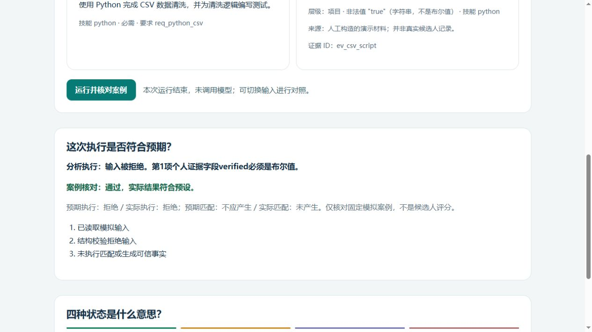
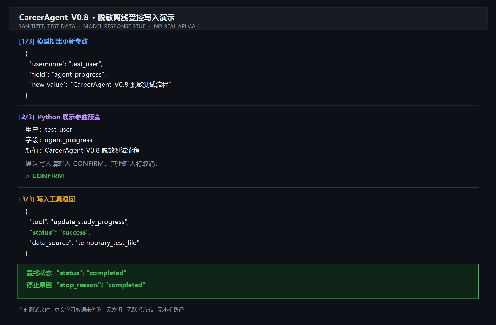

# CareerAgent

CareerAgent 是一个面向求职学习场景的 Python Agent 项目。它使用受控工具读取脱敏岗位、候选人证据和学习进度，由 Python 计算并核对匹配结果，再让千问生成明确标为未验证内容的结构化建议。

最新版本：`V1.6`

V1.6 定位为“输入、证据与判定过程演示”：模拟案例和历史资料分别展示，尚未完成真实 JD 或当前个人能力的资料评估。

## 文档导航

- 当前功能与验证结果：[`docs/PROJECT_STATUS.md`](docs/PROJECT_STATUS.md)
- 当前公开版本范围：[`docs/PROJECT_SCOPE.md`](docs/PROJECT_SCOPE.md)
- 版本演进与历史验证证据：[`docs/CAREER_AGENT_HISTORY.md`](docs/CAREER_AGENT_HISTORY.md)
- 项目主张、代码证据与面试讲解：[`docs/PROJECT_EVIDENCE.md`](docs/PROJECT_EVIDENCE.md)
- 手工脱敏 JSON 的本机私有入口及独立资料页面：[`docs/PRIVATE_CASES.md`](docs/PRIVATE_CASES.md)；不让原演示页读取私人文件，不解析原始 PDF。

## 当前功能

- 对用户、学习进度、脱敏岗位和候选人证据进行结构与范围校验；复习任务由本地可信目录核对题号、题名和专题。
- 千问通过受控工具读取当前范围内的数据并生成结构化建议；Python 核对来源，模型文字仍标为未验证。普通建议流程也可使用无 API 费用的本地规则模式。
- 用户明确选择更新后，模型只提出参数；Python 展示并校验提案，只有用户输入精确的 `CONFIRM` 才写入和回读。
- Python 按相同 `skill_id`、证据层级和验证标记计算 `matched`、`partial`、`unverified`、`missing`；`trusted_facts` 只由结构化数据生成。
- 本地 FastAPI 提供健康检查、岗位要求查询和默认离线确定性分析；HTTP 客户端不能指定数据文件或模型，分析不需要密钥。
- V1.6 的本机 `/demo` 页面展示模拟岗位、证据描述与来源、判定原因，以及独立预设与实际结果的对照；支持四态与非法输入拒绝五个案例。
- “历史用户完整资料”集中展示固定 `test_user` 的目标岗位、全部能力证据、学习进度和复习任务；保留原始记录与验证标记，并与模拟案例分开。
- 固定脱敏案例与模型响应替身用于离线评估，报告公开适用案例数和指标局限；V1.4 补充项目主张与代码、测试、演示的证据映射。

普通建议循环只向模型开放 `get_study_progress`。写入提案必须由用户明确选择 `update` 才会生成，确认前不会修改文件。

复习任务结构、建议来源及各版本的实现细节见[项目状态](docs/PROJECT_STATUS.md)与[版本历史](docs/CAREER_AGENT_HISTORY.md)。

## 环境

- Python 3.13
- Windows / PowerShell
- 千问 AI 平台 OpenAI 兼容接口
- FastAPI 与 Uvicorn 本地只读 API

## 安装

```powershell
python -m venv .venv
.venv\Scripts\python.exe -m pip install -r requirements.txt
```

如果只体验本地只读 API 或演示页，可以跳过下面的 `.env` 和千问密钥配置，直接进入“本地只读 API 与演示页”章节。

复制 `.env.example` 为 `.env`，然后只在本地填写：

```ini
DASHSCOPE_API_KEY=你的千问API密钥
CAREER_AGENT_MODE=llm
```

`.env` 已被 `.gitignore` 忽略。请勿把真实密钥写入代码、截图或提交记录。

## 命令行运行

```powershell
.venv\Scripts\python.exe main.py
```

按提示输入演示用户名：

```text
test_user
```

随后选择操作：

```text
advice  # 生成建议；直接回车也是此模式
job     # 分析脱敏岗位与候选人证据
update  # 根据明确要求生成更新提案
```

选择 `job` 后输入脱敏示例岗位 ID：

```text
demo_ai_agent_intern
```

岗位分析会产生千问 API Token 用量，但只允许读取固定的项目数据文件，不会执行写入。

选择 `update` 后，程序会先显示完整提案。核对用户名、字段和新值后：

```text
CONFIRM  # 精确输入此确认词才会保存
其他输入  # 取消，不调用写入工具
```

如需使用完全本地、无 API 费用的规则模式，将 `.env` 中的模式改为：

```ini
CAREER_AGENT_MODE=rule
```

## 本地只读 API 与演示页

原 `POST /analyses` 默认读取历史脱敏 JSON，响应与保存示例保持一致。V1.6 的 `/demo` 改用独立的五个模拟案例，复用相同校验、匹配与可信事实函数，展开输入和判定过程。两个流程均不调用真实模型、不需要 API Key，也不会写入文件。服务仅供本机演示使用，请只按示例监听 `127.0.0.1`；当前没有身份验证，请勿用于真实候选人数据或公网部署。

在第一个 PowerShell 终端启动仅监听本机的服务：

```powershell
.venv\Scripts\python.exe -m uvicorn api_app:app --host 127.0.0.1 --port 8000
```

看到 `Uvicorn running on http://127.0.0.1:8000` 后，浏览器打开 `http://127.0.0.1:8000/demo`：

1. 在“对照案例”中选择输入，先查看岗位要求、证据、来源、层级和验证标记。
2. 点击“运行并核对案例”，查看真实执行步骤、匹配原因、可信事实和预期／实际对照。
3. 切换案例再次运行，比较证据层级、验证标记或证据缺失怎样影响结果。

如需查看用户现有资料，点击页面顶部“历史用户完整资料”。这里只读展示 `users.json`、`study_progress.json` 和 `candidate_evidence.json` 中 `test_user` 的已有演示字段，列出全部证据、三类学习进度和全部复习任务。证据按已验证项目／生产、已验证学习／练习、待核实描述分组；空分组表示没有相应记录，不能据此断言用户不会。

这份资料保留 V1.0 的历史文字与 106 项测试记录，不会因为当前项目新增代码就自动更新个人能力。它不是五个模拟案例的输入。`GET /demo/profile` 不接受用户名或文件路径等查询参数；文件缺失或非法时返回 503。服务已运行时，需要重启并刷新页面以加载新增接口。

| 案例 | 分析执行 | 实际匹配 | 案例核对 |
|---|---|---|---|
| 已验证项目证据 | 完成 | `matched` | 符合预设 |
| 已验证练习证据 | 完成 | `partial` | 符合预设 |
| 描述尚未核实 | 完成 | `unverified` | 符合预设 |
| 尚无相关证据 | 完成 | `missing` | 符合预设 |
| 非法验证标记 | 输入被拒绝 | 不产生匹配 | 正确拒绝，符合预设 |

“案例核对通过”只表示固定模拟输入的执行、完整匹配和可信事实均符合独立预设；不是候选人评分或真实招聘结论。可信事实缺失、证据 ID 错误或夹带额外字段时不能通过。合法输入缺少证据时仍可完成分析；连接失败时则显示“分析执行失败、案例核对未完成”。

演示专用 `GET /demo/cases` 返回白名单案例的输入与独立预设；`POST /demo/analyses` 只接受 `case_id`，不接受用户名、任意 JD、证据、文件路径或模型。非法证据案例的 HTTP 200 表示案例运行报告正常返回，报告内的 `execution_status=rejected` 才表示分析输入被拒绝；无效的 HTTP 请求仍返回 422。

真实浏览器中的模拟输入拒绝示例：



V1.5.1 为页面请求设置 10 秒超时；服务连接失败、示例不存在、请求校验失败、数据不可用和结果格式异常会显示对应的固定提示。失败时隐藏结果并恢复按钮，可在处理问题后再次点击；等待期间不会重复发送请求。超时只中止浏览器等待，不表示服务端计算已被取消。浏览器需启用 JavaScript。

如果要复现原来的历史脱敏 API 响应，在第二个 PowerShell 终端运行：

```powershell
Invoke-RestMethod -Uri "http://127.0.0.1:8000/health"
Invoke-RestMethod -Uri "http://127.0.0.1:8000/jobs/demo_ai_agent_intern/requirements"

$analysisBody = @{
    username = "test_user"
    job_id = "demo_ai_agent_intern"
} | ConvertTo-Json

Invoke-RestMethod `
    -Uri "http://127.0.0.1:8000/analyses" `
    -Method Post `
    -ContentType "application/json" `
    -Body $analysisBody
```

分析结果中的三个状态应依次为 `matched`、`matched`、`unverified`。完整脱敏响应见 [`examples/careeragent_v1_3_api_analysis_output.json`](examples/careeragent_v1_3_api_analysis_output.json)。验证完成后在第一个终端按 `Ctrl+C` 停止服务。

## 测试

```powershell
.venv\Scripts\python.exe -m unittest -v
```

单元测试使用模型响应替身，不会真实调用千问，也不会产生模型费用。

页面脚本另有 30 项交互测试，使用 Node.js（JavaScript 运行环境）的内置测试工具、网络与 DOM 替身；已在 Node.js 24.19.0 验证。有 Node.js 22 或更新版本时，在上述项目虚拟环境安装完成后可单独运行：

```powershell
node --test test_demo_page.cjs
```

这组测试覆盖历史资料完整展示与视图隔离、分组遗漏、读取失败重试、后续案例异常、预设替换、可信事实缺失、矛盾拒绝报告、案例切换、超时和文本安全呈现；测试会通过项目虚拟环境读取后端输出。它独立于 Python 回归测试，也不能代替真实浏览器验收。运行应用和 Python 测试无需 Node.js，无需安装额外 npm 包。

本机私有入口另有 23 项终端入口和 22 项私有服务测试，包含这些入口的完整 Python 回归为 240 项；私有页面另有 13 项脚本测试，与原演示页的 30 项合计 43 项。测试只使用人工资料，不依赖个人简历或私有案例；运行方法及隐私边界见[私有案例说明](docs/PRIVATE_CASES.md)。独立私有页面不改变原演示页或原 API 的数据范围，没有身份验证，不用于公网或共享电脑。

运行 V1.2 脱敏离线评估集：

```powershell
.venv\Scripts\python.exe job_analysis_evaluation_runner.py
```

只运行一个案例、一个类别，或将报告保存为新文件：

```powershell
.venv\Scripts\python.exe job_analysis_evaluation_runner.py --case-id normal_project_data
.venv\Scripts\python.exe job_analysis_evaluation_runner.py --category security
.venv\Scripts\python.exe job_analysis_evaluation_runner.py --output "$env:TEMP\careeragent-v1-2-evaluation.json"
```

`--output` 仅接受 `.json` 路径，目标目录必须已存在，且不会覆盖已有文件或项目数据。保存前会扫描报告中的常见手机号、邮箱、绝对本地路径和密钥／令牌格式；这是有限的格式检查，不能保证发现所有敏感信息。

评估运行器只把固定夹具复制到临时目录，并调用现有受控工具和 JD Agent；不会修改项目数据，也不会调用真实千问。

V1.6 在原有 171 项 Python 测试上增加 14 项案例与接口测试、10 项历史资料测试，完整离线测试为 195 项。原评估集的 26 个固定案例仍与预设一致；4 个适用自由文本案例中有 3 个虚构声明被接受，而这些已知声明进入 `trusted_facts` 的数量为 0/4。这只说明固定案例中的事实字段隔离情况，**不代表真实模型面对任意 JD 的准确率或已消除幻觉**。新增五个页面模拟案例不计入原 26 案例评估集。

V1.4 的全新 Python 3.13.5 环境复现、本机 HTTP 验收、脱敏示例一致性与 17 份受版本控制 JSON 不变性记录见[项目状态](docs/PROJECT_STATUS.md)和[版本历史](docs/CAREER_AGENT_HISTORY.md)；个人贡献仍需按真实参与过程核对。固定案例的完整计数和局限见[离线评估报告](examples/careeragent_v1_2_evaluation_report.json)。

脱敏运行证据：

- [`examples/careeragent_v0_6_review_topics_output.json`](examples/careeragent_v0_6_review_topics_output.json)：只读工具与结构化建议。
- [`examples/careeragent_v0_7_confirmed_update_output.json`](examples/careeragent_v0_7_confirmed_update_output.json)：模型提案、用户确认与写入成功；其中复习任务保留当时的 V0.7 历史结构。
- [`examples/careeragent_v0_9b_job_match_output.json`](examples/careeragent_v0_9b_job_match_output.json)：两个岗位/证据只读工具与 Python 确定性匹配结果；不调用真实模型。
- [`examples/careeragent_v1_0_job_analysis_output.json`](examples/careeragent_v1_0_job_analysis_output.json)：三个只读工具、Python 权威匹配和结构化岗位分析；明确标注为离线模型替身示例。
- [`examples/careeragent_v1_2_evaluation_report.json`](examples/careeragent_v1_2_evaluation_report.json)：26 个固定案例的脱敏离线报告，包含案例分类、完整计数指标、复现命令和局限说明。
- [`examples/careeragent_v1_3_api_analysis_output.json`](examples/careeragent_v1_3_api_analysis_output.json)：本地 API 默认离线分析的完整脱敏响应，与自动化测试实际结果逐字段核对。

受控写入脱敏演示截图（离线测试数据与模型响应替身，不调用真实 API，也不修改真实学习数据）：



## 数据流

```text
启动 main.py
→ 加载并验证用户
→ 选择 advice、job 或 update
├─ advice：千问调用只读工具 → 生成建议和sources → Python核对来源
├─ job：千问调用三个只读工具 → Python计算匹配与可信事实 → 模型生成未验证解释 → Python核对状态和来源
├─ update：千问生成参数提案 → Python验证 → 用户确认 → 执行或取消
├─ evaluation：加载脱敏案例和夹具 → 临时数据 → 模型替身运行Agent → 汇总指标
└─ local API：固定服务端文件 → Python确定性匹配 → trusted_facts → 只读HTTP响应
```

## 项目边界

- 建议流程中，千问可以选择只读工具；写入流程仍由程序和用户共同控制。
- `requested_tools` 表示模型提出调用，`used_tools` 表示 Python 已实际执行；取消时后者为空，确认执行后才包含写入工具。
- 当前提供固定脱敏案例的本机演示页面；没有 RAG、多 Agent、自动岗位搜索或自动投递。
- `used_tools` 记录实际执行过的工具；`trace` 同时记录模型决策和程序动作。
- V1.3 API 只提供本地脱敏数据的只读访问和确定性分析，不包含身份系统、云部署或真实候选人数据。
- V1.2 安全与评估结果来自固定脱敏数据和模型替身，不冒充真实模型红队测试结论；`0/4` 可信事实泄漏也不等于完整幻觉治理。
